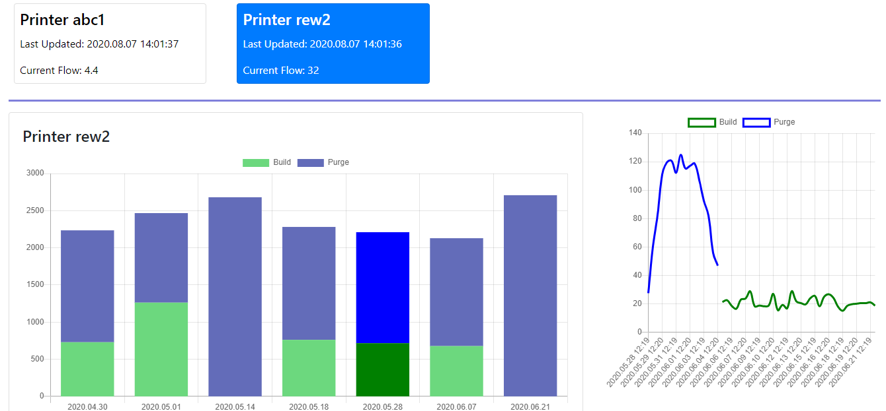

# Simple Chart with Vue

A Full Stack Web Application built with Node.js, Express.js, Vue.js, MySQL and Bootstrap for interactive Chart and Graph.

To run, you just have MySQL installed and running, and NodeJS installed.

# Modules

  - A powerful Login and Authentication System - JWT based authentication and authorization.
  - Clean Chart and Graph with interactions.

### Technology Stack Used

This project uses a number of open source tools, technologies and frameworks to work properly:

* [Visual Studio Code](https://code.visualstudio.com) - A code editor redefined and optimized for building and debugging modern web and cloud applications. 
* [Twitter Bootstrap](https://www.getbootstrap.com) - Great UI boilerplate for modern web apps.
* [node.js](https://www.nodejs.org) - Evented I/O for the backend. Node.js® is a JavaScript runtime built on Chrome's V8 JavaScript engine.
* [Express](https://www.expressjs.com) - Express is a minimal and flexible Node.js web application framework.
* [Html, CSS, JavaScript](#)

### Installation

This project requires [Node.js](https://nodejs.org/) v10+ to run.

Install dependencies for backend and frontend

> You will need to npm install in each directory in order to install the node module needed for each part of the project

> Directories Include: backend & frontend

### Run the application

To run, you just have MySQL installed and running.

In both "backend" and "frontend" directories

```bash
$ npm start
```

Your app should now be running on [localhost:8080](localhost:8080).

# Preview

<p align="center">
  
  
</p>
